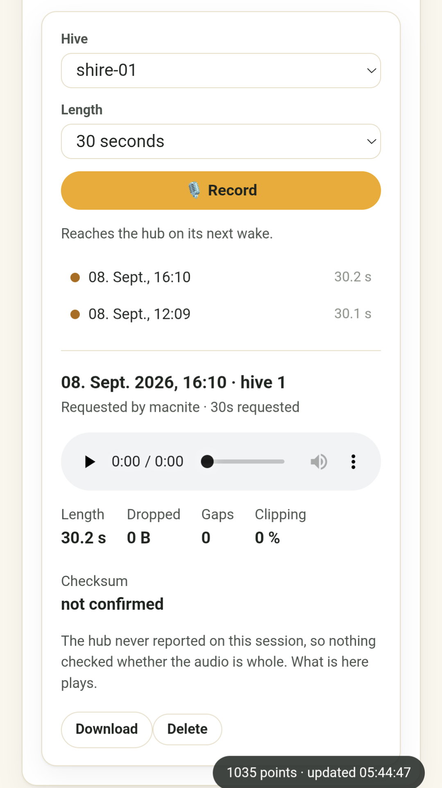

# Listening to a hive

*Firmware **0.30.0** · server **0.5.1** · HiveInside **0.6.2** · issue [#71](https://github.com/MacNite/HiveInside/issues/71)*

A HiveInside node can be asked to record from inside
the hive. The hub relays the audio to the backend as it is captured, and the
dashboard plays it back when it arrives.

```
HiveInside                    HiveHub                     backend        browser
PDM mic → PCM16 → 32 KiB ring → BLE notify → 32 KiB ring → chunked POST → PCM/WAV
   16 kHz, 32 kB/s              137 kB/s measured          raw on disk    <audio>
```

> **Use HiveInside 0.6.2 or later.** The protocol works on 0.6.0 and 0.6.1, but
> a measurement cycle could drop the microphone's power rail underneath a
> running session: those builds return a full-length recording whose first ~50 ms
> carry sound and whose remainder is the noise floor of an unpowered mic. Nothing
> flags it — the byte count and checksum are perfect, because every byte the node
> sent did arrive. If a recording plays for a moment and then goes silent, check
> the node's version before anything else. HiveInside's
> `docs/audio-over-ble.md` has the mechanism.

This is the firmware-over-BLE relay in reverse, and deliberately so: the same
locate-scan, the same NimBLE client shape, the same crash-safe command
reporting. See [the OTA relay](hiveinside-ble-sensor.md#firmware-updates-ota-relay)
for the other direction, and HiveInside's
[`docs/audio-over-ble.md`](https://github.com/MacNite/HiveInside/blob/main/docs/audio-over-ble.md)
for the wire protocol.

## Why raw PCM, and why streaming

Both answers come from one measurement. Notification throughput from a
HiveInside node to an ESP32-C6 was measured at **137 kB/s** (15 ms connection
interval, 2M PHY, 251-byte PDUs). The microphone produces **32 kB/s**.

* **No codec.** Compressing would be fitting a pipe that is not full. Worse, a
  lost ADPCM packet corrupts decoder state and everything after it, while a lost
  PCM packet is just a hole. The wire format keeps a `format` byte with ADPCM
  reserved, so this can change without a protocol break.
* **Streamed, not buffered.** The node holds ~1 second of audio, not a whole
  clip: buffering 60 s would be 1.9 MB of static RAM on a 512 KB part that also
  runs a BLE stack.

The OTA relay's ~1.4 kB/s is not a counter-example. That path writes with
response (two connection intervals per chunk) and flushes RRAM synchronously
inside the ATT callback, where each write runs in a radio timeslot that
pre-empts connection events. It measures flash scheduling, not the radio.

## Setting it up

### 1. Generate the key

The node will not record without an authenticated request, and the hub will not
ask without a key. The two sides want the **same 32 bytes** in different
notations — a hex string on the hub, a C array on the node — so generate once
and print both:

```bash
KEY=$(openssl rand -hex 32)
echo "HiveHub  secrets.h:  #define HIVEINSIDE_AUDIO_PSK_HEX \"$KEY\""
echo "HiveInside audio_secret.h:"
echo "$KEY" | sed 's/../0x&, /g' | fold -sw 48 | sed 's/^/\t/;s/ $//'
```

Keep the output somewhere safe until both devices are flashed; nothing stores
the key anywhere else, so a lost key means reflashing both sides with a new one.

### 2. Put it on the hub

Add one line to `firmware/include/secrets.h` (gitignored — copy
`secrets.example.h` if you do not have one yet). It can go anywhere in the file;
next to the other HiveInside settings keeps it findable:

```c
#define HIVEINSIDE_AUDIO_PSK_HEX "40d813ad974c1506...5919426b"
```

64 hex characters, no `0x` prefix, no spaces. Anything else — a short string, a
stray `0x`, all zeros — is treated as "no key configured" and every session is
refused with a message saying so.

### 3. Put it on the node

Copy `firmware-nrf54lm20a/src/audio_secret.example.h` to
`firmware-nrf54lm20a/src/audio_secret.h` (also gitignored) and replace the
zeroed array with the rows the command above printed:

```c
#pragma once
#include <stdint.h>
static const uint8_t hive_audio_psk[32] = {
	0x40, 0xd8, 0x13, 0xad, 0x97, 0x4c, 0x15, 0x06,
	0x27, 0x03, 0xa0, 0x4e, 0x1f, 0xa3, 0x67, 0x25,
	0xf7, 0x09, 0x33, 0x30, 0xa8, 0xd3, 0xd1, 0x01,
	0x81, 0xfc, 0xdf, 0xe5, 0x59, 0x19, 0x42, 0x6b,
};
```

Both sides fail closed when the key is missing or all-zero. That is the intended
behaviour, not a bug to work around: the alternative is a microphone in a garden
that any BLE device in range can switch on.

### 4. Flash both

HiveHub with `HIVEINSIDE_AUDIO_ENABLED` (default on wherever `ENABLE_BLE_SCAN`
is), HiveInside with 0.6.2 or later.

> **`FORCE_RESEED` is not needed.** That flag only re-seeds the *claim code*
> from `secrets.h` into NVS preferences (see `device_prefs.cpp`). The audio key
> is never stored in preferences — the relay reads the compiled-in macro at the
> start of every session — so an ordinary flash or OTA is enough. Setting
> `FORCE_RESEED` would only re-push the claim code, which is unrelated and
> forces a re-registration you do not want.

**Update both sides together.** The key is checked on every session, so between
flashing one device and the other, audio fails with "authentication failed"
while measurements keep working normally. That asymmetry is the giveaway: if
readings are fine and only listening is broken, suspect the key before the
radio.

### 5. Mount the storage

`RECORDINGS_DIR` (default `/app/recordings`) needs a volume — the compose file
ships one. Without it the database keeps rows whose audio vanished on the next
container recreation.

## Using it

**Dashboard → Audio → "Hive audio".** Pick a hive, pick a length (10, 30 or 60
seconds), press **Record**. Then the part that surprises people:

> **It is not instant.** The hub deep-sleeps and only collects commands on its
> next wake, so a recording arrives within one reporting interval — minutes,
> not seconds. The panel says "Waiting for the hub to wake" for exactly this
> reason.

The panel is split: the request controls sit in the left rail above the list of
sessions, newest first, and selecting one fills the right-hand side with its
player, its quality figures and a download button. On a narrow screen the two
columns stack, which is what the shot below shows.

 A request follows its three
states in place — *waiting for the hub*, *being recorded*, done — and the
finished audio plays as an ordinary WAV.

The coloured dot beside each session is the same verdict the *Checksum* figure
spells out (see [How sure we are](#how-sure-we-are-confirmation)); the figures
are shown for every recording, not just broken ones, because a spliced recording
sounds perfectly continuous.

Only hives with a HiveInside are offered. Nothing else on a hub has a
microphone, and a request against a HolyIot or RuuviTag could only fail a wake
cycle later.

Shorter is usually better: 10–20 seconds is enough to hear what an insight
flagged, and costs proportionally less battery and less time with the hive off
the air — a connected node neither advertises nor samples, so its readings pause
for the length of the session.

### Why this is not "live listening"

The transport underneath *can* stream: the hub uploads while the microphone is
still running, the server writes the file as it lands, and
`GET /recordings/{id}/pcm?offset=` reads a session that is still being written.
An API consumer can use that to follow a recording in flight.

The dashboard deliberately does not, because the lead-in makes the label
dishonest. A "listen now" button that sits silent for several minutes before the
first sound sets an expectation the hardware cannot keep, and a beekeeper
staring at a silent player cannot tell a working request from a broken one. The
smaller promise — you ask for N seconds, and it appears when the hive has been
heard — is one the system always keeps.

## Reading the quality flags

A session can produce audio that is worth hearing and still not be whole. The
dashboard says so rather than letting you find out by ear, because a recording
with a hole in it plays as perfectly continuous sound — and an acoustic
judgement made on a splice is wrong in a way nothing later reveals.

| Flag | Meaning |
|---|---|
| `dropped_bytes` | The node's own ring overran — audio never left the hive |
| `gaps` | Sequence jumps on the air, or the hub's ring overran |
| CRC mismatch | What arrived is not what the node computed: corruption in transit |
| `clipped_pct` | Samples hit the rail; lower the gain |

Audio either side of a gap is real. The join is not.

### How sure we are: `confirmation`

The hub reports on a session **twice**, and either report can go missing, so
"was this recording whole?" has more than two answers. `confirmation` is the one
the dashboard shows as the *Checksum* figure.

| Value | Shown as | What happened |
|---|---|---|
| `verified` | verified | The detailed `/finalize` report arrived and its CRC matched what the server computed over the bytes on disk |
| `reported` | unverified | `/finalize` arrived, but the CRCs disagree or the hub sent none. Only a CRC that actually disagrees marks the recording incomplete — an absent one is not evidence of damage |
| `confirmed` | hub confirmed | `/finalize` never arrived, but the hub's **command result** said the session succeeded. Nothing checked the bytes, but the hub did say it finished |
| `unknown` | not confirmed | Neither report arrived. The audio on disk plays; nothing corroborates it |

The middle two exist because `/finalize` is a single fire-and-forget POST that a
reset or a dropped packet takes with it, while the command result is retried,
swept when it goes stale, and written under the same crash-safe marker as every
other device command. Reading both is why a recording that is almost certainly
fine no longer gets told it lost contact with its hub. It is also why the
command result *closes* the row (`recordings.finalize_from_command_result`) and
a later `/finalize` only adds detail to it.

## Storage

Recordings are raw 16 kHz mono PCM16 on disk. The WAV header is generated per
request, so the same bytes serve both the live player and a `.wav` download, and
a recording still being written never needs its header rewritten.

**Nothing prunes them.** There is no retention sweep — a deliberate choice — so
the only thing between a self-hosted disk and a season of audio is the delete
button. One minute is about 1.9 MB.

## API

Three surfaces, the same functions behind each: master key
(`/api/v1/devices/…`, `/api/v1/recordings/…`), dashboard session
(`/api/v1/local/…`), HivePal user (`/api/v1/app/…`).

| Endpoint | Purpose |
|---|---|
| `POST …/devices/{id}/commands/record-audio?slot=&duration=&gain_db=` | queue a session; `duration=0` is live |
| `GET …/devices/{id}/recordings` | list, newest first, optionally `?hive=` |
| `GET …/recordings/{id}` | one recording's metadata and quality flags |
| `GET …/recordings/{id}/pcm?offset=` | raw PCM from an offset — reads a session while it is still being written; 204 means "nothing new yet". Not used by the dashboard; see "Why this is not live listening" above |
| `GET …/recordings/{id}/audio.wav` | the finished recording, playable anywhere |
| `DELETE …/recordings/{id}` | remove the row and its audio |

Requesting audio needs the admin role on the dashboard, or owner/admin in
HivePal. Listening to what already exists follows the usual per-device roles.

The hub's own ingest (`…/recordings/{id}/stream` and `/finalize`) is
device-authenticated and not for general use. Note that the hub builds those
URLs from its own device id and never from the command payload — a hub that
posted microphone audio to whatever address a queued command named would be one
malformed command away from streaming somebody's garden to a stranger.

## Privacy

Worth stating plainly, because it is easy to forget what this feature is: an
in-hive microphone in a garden can pick up human speech.

* Audio is stored unencrypted on your server.
* It is never part of public chart embeds and is not included in data exports.
* The BLE link is authenticated but not encrypted — the HMAC proves *who may
  ask*, not that the audio itself is private in flight. Someone with a sniffer
  in radio range could capture a session in progress.
* Recordings are kept until deleted, and the dashboard names who requested each.

## Troubleshooting

| Symptom | Cause |
|---|---|
| "no HiveInside audio key configured on this hub" | `HIVEINSIDE_AUDIO_PSK_HEX` is missing, empty, not 64 hex characters, or all zeros in `secrets.h` — see [Generate the key](#1-generate-the-key) |
| "authentication failed" | The two keys differ, or the node has none. Usually one side was flashed and the other not; measurements keep working, which is what makes this look like a radio fault rather than a key one |
| "audio service not found" | The node is running firmware older than 0.6.0 |
| "HiveInside not found in scan" | Out of range, flat battery, or busy with an OTA |
| Stuck at "Waiting for the hub to wake" | Normal for up to one reporting interval; longer means the hub is offline |
| A recording stays at "requested" forever | The command never reached the queue. Check the server log for `could not queue record_audio`; the row is marked failed with the reason from 0.30.0 on |
| A recording sits at "streaming" | Neither the command result nor `/finalize` arrived — a reset mid-session, or a hub that went offline before its next wake. The audio is on disk and plays anyway; after five minutes the row resolves to ready with `confirmation: unknown`. `SELECT result->>'message' FROM device_commands WHERE command_type = 'record_audio' ORDER BY id DESC LIMIT 1;` is the hub's own account of what happened |
| Audio is loud for a moment then near-silence | The microphone lost power mid-session. On HiveInside before the sensor-rail fix, a measurement cycle already running when the session started would switch LDO1 off underneath it |
| "node busy" | An OTA or another session holds the node's single connection |
| Recording marked incomplete | See the quality flags above |
